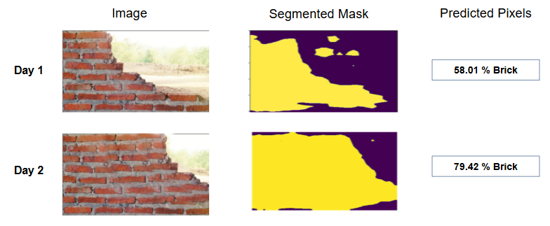

# ConSeg: Construction Site Progress Monitoring

ConSeg is a deep learning-based tool for monitoring construction site progress using semantic segmentation. It leverages a finetuned DeepLabV3+ model to segment construction elements from site images and calculate area changes, enabling automated progress tracking.

## Highlights
- **Pixel Accuracy:** 82.35%
- **Average IoU per Class:** 87.40%

## Features
- **Semantic Segmentation**: Identifies 13 construction-related classes in site images.
- **Progress Calculation**: Computes area change of construction elements to estimate progress.
- **Easy Inference**: Run inference on new images to visualize segmentation and monitor changes.

## Dataset
- The model is finetuned on a Roboflow dataset containing construction site images and their corresponding segmentation masks, annotated with 13 classes.

## Model
- The backbone is DeepLabV3+ (ResNet-101), finetuned for the construction material's segmentation task.
- You can download checkpoint from Google Drive: [Download Checkpoint](https://drive.google.com/file/d/1Xkwr2Ecj0S8GdIEPIuDGLBx3aGSoAPOa/view?usp=sharing).

## Example
Below is an example of a construction site image and its predicted segmentation mask:



## Usage
1. **Preprocess the dataset** (if needed):
   ```bash
   python preprocess.py
   ```
2. **Train the model**:
   ```bash
   python main.py --mode train
   ```
3. **Run inference**:
   ```bash
   python infer.py
   ```

## Citations
- **Model Architecture**: [DeepLabV3+](https://arxiv.org/abs/1802.02611)
- **Dataset**: [Roboflow](https://roboflow.com/)
- **GPU Resources**: [Kaggle](https://www.kaggle.com/)

---

*Developed for automated construction progress monitoring using deep learning.*

---

⭐ **If you like this project, please consider starring the repository!**
